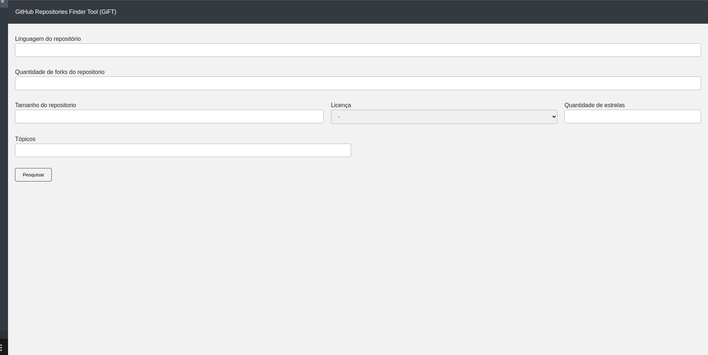

## GitHub Repositories Finder Tool

Essa ferramenta foi desenvolvida com o propósito de facilitar a construção de datasets para a aréa de mineração de software. Com gift 
você pode especificar características que podem ser importantes para a sua base de dados. Ela também permite que você selecione as
releases do repositório. Com o repositório selecionado você também poderá baixar ele, sem link externos

## Processo de instalção

Para instalar as dependências utilize o comando, npm install. Para executar o programa digite, node server.js. Agora digite no navegador localhost:3000

## Campos que GIFT disponibiliza

* Linguagem
* Quantidade de forks
* Tamanho do repositório
* Lincença
* Quantidade de estrelas
* Tópicos
* Tempo do repositório
* Quantidade de repositórios que serão retornados(A api do git só pemite no máximo 100, caso não preencha esse campo o valor de retorno são repositórios)

## Gift visão geral

