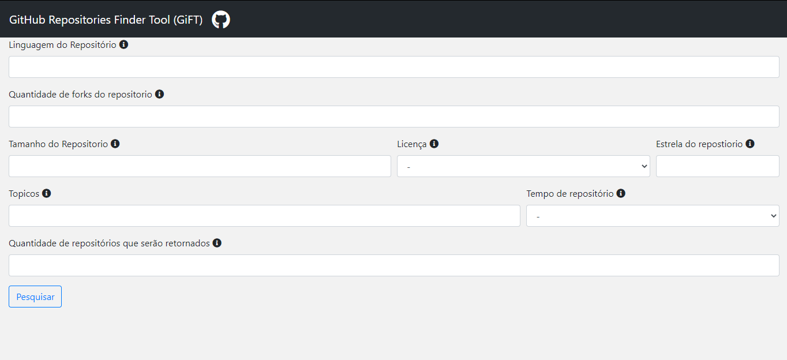
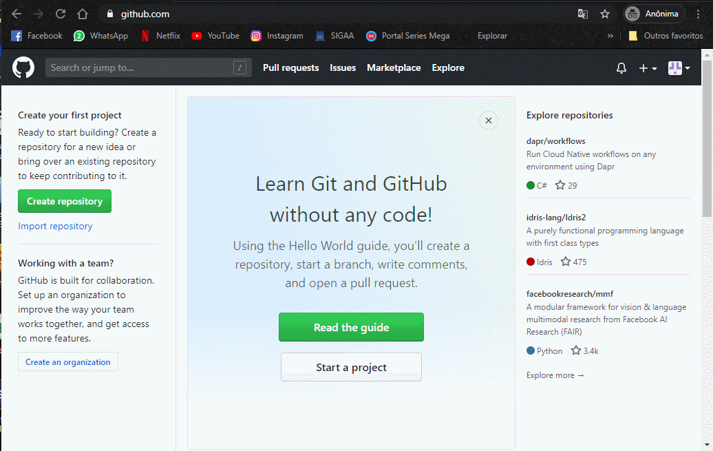

## GitHub Repositories Finder Tool

Essa ferramenta foi desenvolvida com o propósito de facilitar a construção de datasets para a aréa de mineração de software. Com gift 
você pode especificar características que podem ser importantes para a sua base de dados. Ela também permite que você selecione as
releases do repositório. Com o repositório selecionado você também poderá baixar ele, sem link externos

* Linguagem
* Quantidade de forks
* Tamanho do repositório
* Lincença
* Quantidade de estrelas
* Tópicos
* Tempo do repositório
* Quantidade de repositórios que serão retornados(A api do git só pemite no máximo 100, caso não preencha esse campo o valor de retorno são repositórios)

## Gift visão geral

## Token do usuário

Para termos acesso as releases termos que ter um token pessoa da sua conta. Mas não se preocupe esse token é apenas para api consultar as releases,
abaixo está a demonstação de como conseguir esse token e como colocar na ferramenta.

